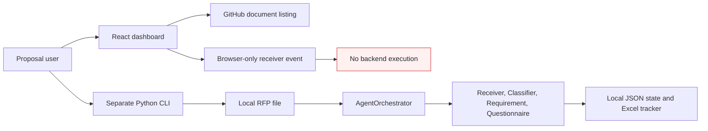
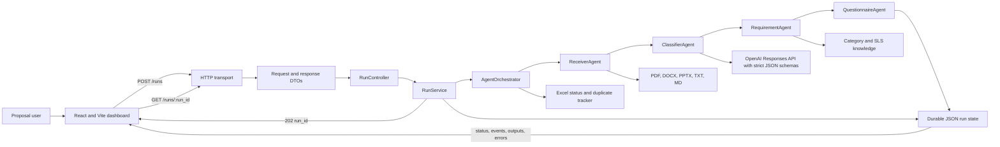

# Proposal Response Orchestration - Before and After Architecture

## Architecture objective

Move the hackathon MVP from a disconnected, local batch workflow to a layered REST service that connects the React dashboard to the agent orchestration pipeline while preserving validation, traceability, duplicate protection, durable state, and human review.

## Before: local and disconnected batch flow



## After: layered REST service



## Layer responsibilities

| Layer | Responsibility | Implementation |
| --- | --- | --- |
| UI | Collect account/document selection and display run progress | `Dashboard/src/App.jsx` |
| HTTP transport | Parse HTTP, JSON, CORS, routing, and response serialization | `orchestration/http_server.py` |
| DTO | Validate request fields, source choice, URL shape, and response contracts | `orchestration/api_dtos.py` |
| Controller | Convert DTO validation and service outcomes into HTTP-independent status/body responses | `orchestration/run_controller.py` |
| Service | Allocate run IDs, persist accepted state, start background work, and retrieve status | `orchestration/run_service.py` |
| Domain orchestration | Coordinate Receiver, Classifier, Requirement, and Questionnaire agents | `orchestration/orchestrator.py` |
| Persistence | Atomically save and load durable run state; track status and duplicates | `orchestration/state_store.py`, `orchestration/tracker.py` |

## REST contract

### Create a run

```http
POST /runs
Content-Type: application/json

{
  "account": "Bank 1",
  "source_url": "https://github.com/CognizantCodex/ProposalResponseOrchestration/blob/develop/sample-data/rfps/mock-01-cloud-migration.md"
}
```

Exactly one of `source_url` or `source_path` is required. Unknown fields, invalid URLs, empty values, oversized JSON, and malformed JSON return HTTP `400`.

Successful response:

```json
{
  "run_id": "<uuid>",
  "status": "STARTED"
}
```

### Get run status

```http
GET /runs/{run_id}
```

A malformed UUID returns `400`; an unknown valid UUID returns `404`; a known run returns its durable `PipelineState`.

## Change summary

| Concern | Before | After |
| --- | --- | --- |
| Invocation | Manual CLI run | Dashboard creates a run through `POST /runs` |
| Validation | Inline dictionary access in HTTP handler | Strict DTO parsing and validation |
| Routing | HTTP handler owned business behavior | Controller maps transport-independent responses |
| Execution | Handler created threads and orchestrator state | Service owns run lifecycle and background execution |
| Status | Direct filesystem access from handler | Service reads through `StateStore` |
| Testing | Orchestrator-only test | DTO, controller, service, status, and error-path tests |
| Failure before orchestration | Could leave no status file | Service persists accepted state and records startup failure |

## Runtime

1. Start the REST service: `python -m orchestration.http_server --port 8000`.
2. Set `VITE_AGENT_API_BASE=http://127.0.0.1:8000`.
3. From `Dashboard`, run `npm install` and `npm run dev`.
4. Select an account and document, start the receiver, and monitor the returned run ID.
5. Run tests with `python -m unittest discover -s tests -v`.

## Production boundary

The layered REST service is an MVP. Production deployment still requires authentication and authorization, TLS, restricted CORS, a durable queue, transactional state, account isolation, secrets management, observability, rate limiting, and approval controls for enterprise write actions.
