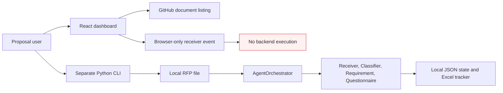
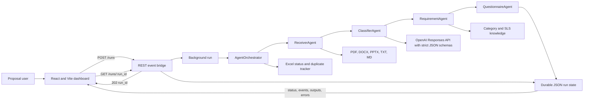

# Proposal Response Orchestration - Before and After Architecture

## Architecture objective

Move the hackathon MVP from a disconnected, local batch workflow to a runnable REST service that connects the React dashboard to the agent orchestration pipeline while preserving traceability, duplicate protection, durable state, and human review.

## Before: local and disconnected batch flow



**Limitations:** the UI and orchestration runtime are separate, the user must invoke the CLI manually, the browser event is not durable, progress is not available through an application API, and local files are the primary runtime boundary.

## After: UI-connected REST service



## Change summary

| Concern | Before | After |
| --- | --- | --- |
| Invocation | Manual CLI run | Dashboard creates a run through `POST /runs` |
| Input | Local path only | Account plus `source_url` or `source_path` |
| Response | CLI prints final JSON | API immediately returns `202`, `run_id`, and `STARTED` |
| Progress | Inspect local files manually | Dashboard polls `GET /runs/{run_id}` |
| Execution | Synchronous user command | Background orchestration thread |
| State | JSON and Excel written locally | Same durable stores exposed through the REST status endpoint |
| Validation | Receiver validates local input | Receiver validates input, extracts text, and checks SHA-256 duplicates |
| Agent outputs | Available after CLI completion | Status, events, classification, ownership, and questions returned to the UI |
| Failure handling | Terminal CLI error | Retry events and failure details persisted for status retrieval |
| Human control | Manual review outside the UI | Outputs remain drafts; approvals are required before commitments or submission |

## REST contract

### Create a run

```http
POST /runs
Content-Type: application/json

{
  "account": "Bank 1",
  "source_url": "https://github.com/CognizantCodex/ProposalResponseOrchestration/blob/develop/Customer%20RFP%20Documentation/Bank%201/sample.docx"
}
```

Successful response:

```json
{
  "run_id": "<uuid>",
  "status": "STARTED"
}
```

### Get run status

```http
GET /runs/{run_id}
```

The response is the durable `PipelineState`, including the current agent, status, attempts, event history, receiver metadata, classification, ownership, questionnaire, and error details.

## Source mapping

| Layer | Repository implementation |
| --- | --- |
| UI | `Dashboard/src/App.jsx` |
| REST controller boundary | `orchestration/http_server.py` |
| Orchestration service | `orchestration/orchestrator.py` |
| Request/output models | `orchestration/models.py` and strict schemas in each agent |
| Document extraction | `orchestration/document_reader.py` |
| Durable state | `orchestration/state_store.py` |
| Progress and duplicate tracking | `orchestration/tracker.py` |
| Automated verification | `tests/test_orchestrator.py` |

## Runtime

1. Start the REST service: `python -m orchestration.http_server --port 8000`.
2. Set the dashboard API base: `VITE_AGENT_API_BASE=http://127.0.0.1:8000`.
3. Start the UI from `Dashboard`: `npm install`, then `npm run dev`.
4. Select an account and document, run ReceiverAgent, and monitor the returned run ID.

## Production boundary

The REST bridge is an MVP implementation. Production deployment still requires authentication and authorization, TLS, restricted CORS, validated request DTOs, a durable queue, transactional state, account isolation, secrets management, observability, and approval controls for enterprise write actions.
